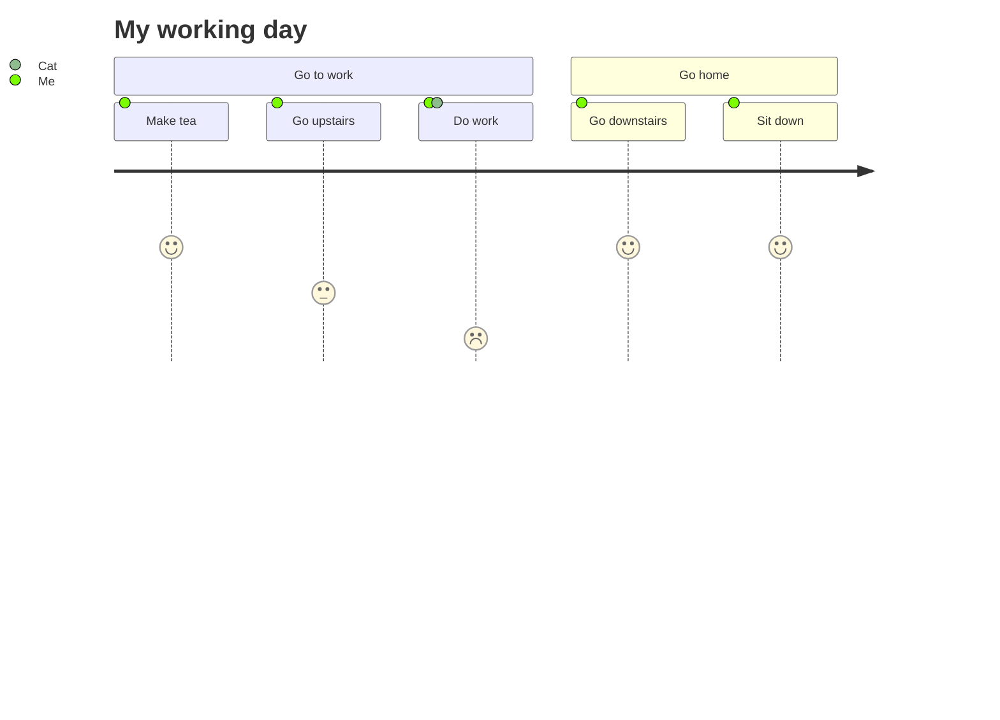

  
안녕 여긴 블로그야 그러고보니 컨텐츠가 바뀌면 그것도 정리를 해야하는데 말이지

어떻게 해야할지 모르겠어 

니가 방법을 제시해줘  알겠어. 일단 내가 해볼게

코드 적는거 그만하고 


## Hello World

```js
console.log('Hello World')
```

## Hello World

```js
console.log('Hello World')
```

블로글 글을 생성해보자. 

## Hello World

```js showLineNumbers
console.log('Hello World')
```

# Code

```bash
journey
    title My working day
    section Go to work
      Make tea: 5: Me
      Go upstairs: 3: Me
      Do work: 1: Me, Cat
    section Go home
      Go downstairs: 5: Me
      Sit down: 5: Me
```


